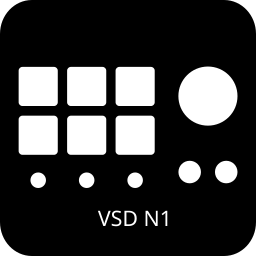

# OpenDeck Basicolor N1 / VSD N1 Plugin



Experimental fork of [opendeck-akp03](https://github.com/4ndv/opendeck-akp03)
for the Basicolor N1 / VSD N1 (`5548:1002`). Exploratory USB captures now show
traffic from VSD Craft under Proton, including 96 × 96 JPEG data. The complete
protocol and key mapping remain unvalidated, so this plugin currently does not
discover the N1 and must not be treated as device support.

The inherited device mappings remain in the source as investigation references.
They are disabled at runtime so this fork does not compete with the original
plugin for those devices. The first implementation target is Linux x86_64 on
Bazzite.

## Development status

J0, the fork identity and Linux package setup, is in place. A local sysfs
inventory and exploratory C01–C03 captures identify two HID interfaces, vendor
traffic and JPEG image data. C03b changed editor fields but did not test VSD's
documented custom-icon flow; it captured only the existing grid images.
Initialization semantics, button-code mapping, image-to-key mapping and OpenDeck
integration still need validation before enabling discovery or publishing
compatibility claims.

See the [development and investigation documents](docs/README.md) for the
scope, protocol capture procedure, Bazzite setup, and acceptance criteria.

## Build

Requirements: Linux, Rust 1.87 or newer, and [just](https://just.systems).
The inherited plugin code targets OpenDeck 2.5.0 or newer; N1 behavior has not
been validated against any OpenDeck version.

```sh
just package
```

This creates `build/opendeck-vsd-n1.plugin.zip`. The
[udev rule](40-opendeck-vsd-n1.rules) is separate and is not installed by
importing the plugin. Its use on a physical N1 still needs validation; see
[the Bazzite procedure](docs/bazzite.md).

## Provenance

The fork preserves the upstream history and [GPL-3.0 license](LICENSE). The
plugin architecture is based on the
[elgato-streamdeck](https://github.com/streamduck-org/elgato-streamdeck) crate
and the original [opendeck-akp03](https://github.com/4ndv/opendeck-akp03)
project.
