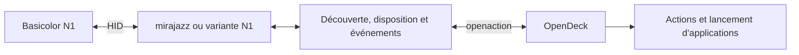

# Plan de développement

## Point de départ vérifié dans le dépôt

État de référence : commit `10d183451807cc172fdf394bdd34f41a33fb52d3`.
Les constats suivants portent sur ce code, pas sur un essai du N1.

| Fichier | État actuel et conséquence pour l'adaptation |
| --- | --- |
| [Cargo.toml](../Cargo.toml) et [Cargo.lock](../Cargo.lock) | Package `opendeck-akp03` en `0.11.0` ; `mirajazz` verrouillé en `0.16.2`, `async-hid` en `0.5.3` et `openaction` en `1.1.5` |
| [manifest.json](../manifest.json) | Identité `st.lynx.plugins.opendeck-akp03`, namespace `n3`, exécutables AKP03 et trois systèmes annoncés |
| [src/mappings.rs](../src/mappings.rs) | TreasLin `5548:1001` présent ; `5548:1002` absent ; requêtes HID avec usage page `65440` (`0xFFA0`) et usage `1` |
| [src/mappings.rs](../src/mappings.rs) | Grille fixe de 3 × 3, neuf touches et trois encodeurs ; TreasLin N3 associé au protocole `3` et à des images JPEG 64 × 64 tournées de 90° |
| [src/watcher.rs](../src/watcher.rs) | Recherche et surveillance des périphériques ; identité construite avec namespace et numéro de série ; un candidat sans numéro de série est écarté |
| [src/device.rs](../src/device.rs) | Appel de lecture du firmware, connexion, luminosité à 50, effacement des images et `flush` avant enregistrement dans OpenDeck ; appel `keep_alive` toutes les 15 secondes |
| [src/inputs.rs](../src/inputs.rs) | Décodage propre aux commandes N3 : six touches avec écran, trois autres boutons et trois encodeurs |
| [src/main.rs](../src/main.rs) | Réception des demandes d'image et de luminosité ; réinitialisation et demande de nouveau rendu après réveil |
| [justfile](../justfile) | `just package` construit Linux, macOS et Windows, puis produit une archive avec l'identité d'origine |
| Règle udev d'origine | Plusieurs modèles autorisés, dont `5548:1001` ; aucune entrée `5548:1002` |

Un ajout de VID/PID déclencherait donc plusieurs commandes héritées dès
l'ouverture. L'expérimentation devra maîtriser ces envois, y compris ceux de la
bibliothèque, de l'arrêt et du réveil, avant de connecter le N1 au chemin normal.

## J0 — identité et assemblage configurés

Le fork utilise maintenant le package `opendeck-vsd-n1`, le nom affiché
`Basicolor N1 / VSD N1`, l'identifiant
`com.forgesoftware.plugins.opendeck-vsd-n1` et le namespace `n1`. Le manifeste
et la recette `just package` ciblent Linux x86_64. L'archive est configurée pour
contenir le manifeste, le binaire, les ressources et `LICENSE` ; la règle
`40-opendeck-vsd-n1.rules` est livrée séparément.

La version du package et du manifeste reste `0.11.0`, héritée du point de
départ. Le numéro et les noms de fichiers ne constituent pas une validation de
support. L'unicité de l'identifiant OpenDeck et du namespace doit encore être
vérifiée avant toute distribution. L'assemblage n'a pas encore été validé par
l'import dans OpenDeck.

Les anciennes requêtes HID sont désactivées dans `src/mappings.rs` pour ne pas
faire ouvrir à ce fork les modèles que l'extension d'origine revendique. Le N1
n'est pas encore interrogé : `5548:1002` ne sera activé qu'après l'observation
de son interface et de son protocole. Aucun appareil n'est donc découvert par
la version de travail actuelle.

Le relevé sysfs consigné dans [l'investigation du protocole](protocole.md)
identifie l'interface candidate `0xFFA0:1` et l'interface clavier séparée. C01
documente l'énumération ; C02–C03 montrent VSD Craft sous Proton échangeant avec
l'interface candidate, avec des réponses de type `ACK` et des images JPEG de
96 × 96 pixels. La reprise C03b n'a testé que les champs de l'action « Ouvrir »,
pas le parcours documenté de changement d'icône ; elle n'a capturé que les images
de la grille existante. Les codes et commandes ne sont pas décodés, la
correspondance avec les touches physiques reste partielle et aucun comportement
du plugin OpenDeck n'a été testé ; J1 reste en cours.

## Identité du fork

Valeurs déjà appliquées. Vérifier l'unicité de l'identifiant et du namespace
avant la première distribution.

| Élément | Valeur actuelle | Emplacements |
| --- | --- | --- |
| Nom affiché | `Basicolor N1 / VSD N1` | `manifest.json` et README ; nom matériel à ajouter après qualification |
| Package Rust | `opendeck-vsd-n1` | `Cargo.toml`, entrée du package dans `Cargo.lock` |
| `PluginUUID` | `com.forgesoftware.plugins.opendeck-vsd-n1` | `manifest.json`, variable `id` du `justfile` |
| Namespace | `n1`, deux caractères, unicité à vérifier | `DeviceNamespace` et `DEVICE_NAMESPACE` ensemble |
| Exécutable Linux | `opendeck-vsd-n1-linux` | `CodePathLin` et collecte du binaire |
| Dossier du plugin | `com.forgesoftware.plugins.opendeck-vsd-n1.sdPlugin` | Assemblage de l'archive |
| Archive | `opendeck-vsd-n1.plugin.zip` | Recette `zip` et documentation de livraison |
| Règle udev | `40-opendeck-vsd-n1.rules` | Nouveau fichier limité à `5548:1002` et procédure Bazzite |

La description et l'auteur du fork ont été adaptés. La provenance, les crédits,
[LICENSE](../LICENSE), l'historique Git et les anciennes entrées du changelog
sont conservés. Le manifeste, le package et le lockfile portent le même numéro
de version.

L'identité propre au fork évite l'écrasement du plugin d'origine. Les modèles
hérités ne sont pas recherchés pendant cette étape. Tout modèle réactivé devra
avoir une compatibilité et une règle d'accès explicitement justifiées.

## Répartition des responsabilités



- **Découverte** : utiliser le VID/PID et les usages HID effectivement relevés.
  Conserver le lien avec l'interface et le chemin du périphérique ouvert ; le
  premier nœud partageant le VID/PID peut être le clavier.
- **Protocole** : réutiliser une variante `mirajazz` si les captures en établissent
  la compatibilité. Isoler les différences de trame, d'initialisation ou d'image
  dans une variante dédiée si nécessaire. Une évolution de la bibliothèque devra
  être référencée par une version ou un commit reproductible.
- **Disposition et entrées** : définir les positions et capacités du N1 à partir
  du relevé matériel. Éviter de modifier globalement les constantes et le décodeur
  N3 si d'autres appareils sont conservés.
- **Cycle de vie** : vérifier identité stable, déconnexion, annulation des tâches,
  reprise et absence de doublon. Traiter explicitement un numéro de série absent.
- **Commandes complémentaires** : luminosité, effacement, maintien de connexion
  et réinitialisation doivent dépendre des capacités confirmées. Le prototype
  boutons ne doit pas être bloqué par une commande optionnelle inconnue.

## Jalons et conditions de passage

| Jalon | Travail | Condition de sortie |
| --- | --- | --- |
| J0 — Préparation | Renommer le fork, préserver provenance et licence, adapter l'assemblage | **Configuré** ; valider unicité et import avant diffusion ; aucune annonce de compatibilité N1 |
| J1 — Observation | Inventorier le N1, capturer initialisation, boutons, image et luminosité disponible | **En cours** : inventaire et captures C01–C03 consignés ; refaire C03b via « Change Icon », décoder l'initialisation, associer les codes `0x0f`/`0x0d` et les JPEG aux positions, comparer le protocole et relever la luminosité si disponible |
| J2 — Prototype boutons | Réaliser une intégration expérimentale isolée ; ouvrir l'interface et transmettre les appuis | Détection unique et correspondance correcte des boutons dans OpenDeck |
| J3 — Prototype image | Implémenter le format, le découpage et l'envoi observés | Image lisible, orientée et adressée correctement sur une touche |
| J4 — Livraison Bazzite | Stabiliser reconnexion, archive, règle udev et installation | Recette native réussie et résultat Flatpak documenté séparément |
| J5 — Extensions | Ajouter chaque capacité supplémentaire observée | Recette propre à chaque capacité et documentation mise à jour |

Les outils d'inventaire peuvent cibler `5548:1002` dès J1. Le prototype de J2/J3
reste expérimental jusqu'à validation. L'ajout à la liste des appareils annoncés
compatibles et l'activation dans une version distribuée suivent cette validation.

Pour chaque commande, consigner la capture, les trames pertinentes et le résultat
de sa reproduction. Une incertitude se traduit par une capacité non annoncée,
avec les investigations restantes documentées.

## Préparer l'archive installable

La recette `just package` construit maintenant la cible Linux x86_64 et assemble
une archive de développement. Cette archive ne contient pas de prise en charge
matérielle active. Le README conserve le prérequis Rust 1.87 ou ultérieur ; la
version effectivement utilisée devra être relevée lors d'une livraison.

Structure prévue pour une archive Linux :

```text
opendeck-vsd-n1.plugin.zip
└── com.forgesoftware.plugins.opendeck-vsd-n1.sdPlugin/
    ├── manifest.json
    ├── opendeck-vsd-n1-linux
    ├── assets/
    └── LICENSE
```

Livrer également `40-opendeck-vsd-n1.rules`, les instructions d'installation et
l'accès au code source correspondant. L'import du plugin dans OpenDeck ne doit
pas être présenté comme installant automatiquement la règle système.

Avant diffusion, vérifier la correspondance `PluginUUID`/dossier, les chemins du
manifeste, le droit d'exécution du binaire, l'architecture et la présence des
ressources. Tester l'import de l'archive finale via **Plugins → Install from file**.
Consigner son empreinte, le commit, les versions d'OpenDeck/Bazzite et les limites
observées dans le [compte rendu de recette](recette.md).
