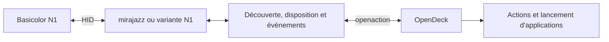

# Plan de développement

## Point de départ vérifié dans le dépôt

État de référence : commit `10d183451807cc172fdf394bdd34f41a33fb52d3`.
Les constats suivants portent sur ce code, pas sur un essai du N1.

| Fichier | État actuel et conséquence pour l'adaptation |
| --- | --- |
| [Cargo.toml](../Cargo.toml) et [Cargo.lock](../Cargo.lock) | Package `opendeck-akp03` en `0.11.0` ; `mirajazz` verrouillé en `0.16.2`, `async-hid` en `0.5.3` et `openaction` en `1.1.5` |
| [manifest.json](../manifest.json) | Identité `st.lynx.plugins.opendeck-akp03`, namespace `n3`, exécutables AKP03 et trois systèmes annoncés |
| [src/mappings.rs](../src/mappings.rs) | TreasLin `5548:1001` présent ; `5548:1002` absent ; requêtes HID avec usage page `65440` (`0xFFA0`) et usage `1` |
| [src/mappings.rs](../src/mappings.rs) | Grille fixe de 3 × 3, neuf touches et trois encodeurs ; TreasLin N3 associé au protocole `3` et à des images JPEG 64 × 64 tournées de 90° |
| [src/watcher.rs](../src/watcher.rs) | Recherche et surveillance des périphériques ; identité construite avec namespace et numéro de série ; un candidat sans numéro de série est écarté |
| [src/device.rs](../src/device.rs) | Appel de lecture du firmware, connexion, luminosité à 50, effacement des images et `flush` avant enregistrement dans OpenDeck ; appel `keep_alive` toutes les 15 secondes |
| [src/inputs.rs](../src/inputs.rs) | Décodage propre aux commandes N3 : six touches avec écran, trois autres boutons et trois encodeurs |
| [src/main.rs](../src/main.rs) | Réception des demandes d'image et de luminosité ; réinitialisation et demande de nouveau rendu après réveil |
| [justfile](../justfile) | `just package` construit Linux, macOS et Windows, puis produit une archive avec l'identité d'origine |
| [Règle udev actuelle](../40-opendeck-akp03.rules) | Plusieurs modèles autorisés, dont `5548:1001` ; aucune entrée `5548:1002` |

Un ajout de VID/PID déclencherait donc plusieurs commandes héritées dès
l'ouverture. L'expérimentation devra maîtriser ces envois, y compris ceux de la
bibliothèque, de l'arrêt et du réveil, avant de connecter le N1 au chemin normal.

## Identité du fork

Conventions proposées pour l'implémentation ; elles ne sont pas encore appliquées.
Vérifier l'unicité de l'identifiant et du namespace avant la première distribution.

| Élément | Cible proposée | Emplacements à adapter |
| --- | --- | --- |
| Nom affiché | `Basicolor N1 / VSD N1` | `manifest.json`, noms d'appareil et README |
| Package Rust | `opendeck-vsd-n1` | `Cargo.toml`, entrée du package dans `Cargo.lock` |
| `PluginUUID` | `com.forgesoftware.plugins.opendeck-vsd-n1` | `manifest.json`, variable `id` du `justfile` |
| Namespace | `n1`, deux caractères, sous réserve d'unicité | `DeviceNamespace` et `DEVICE_NAMESPACE` ensemble |
| Exécutable Linux | `opendeck-vsd-n1-linux` | `CodePathLin` et collecte du binaire |
| Exécutables des autres plateformes, si livrés | `opendeck-vsd-n1-mac`, `opendeck-vsd-n1-win.exe` | Champs `CodePathMac`/`CodePathWin` et collecte |
| Dossier du plugin | `com.forgesoftware.plugins.opendeck-vsd-n1.sdPlugin` | Assemblage de l'archive |
| Archive | `opendeck-vsd-n1.plugin.zip` | Recette `zip` et documentation de livraison |
| Règle udev | `40-opendeck-vsd-n1.rules` | Nouveau fichier limité à `5548:1002` et procédure Bazzite |

Mettre à jour la description, l'auteur du fork et les liens de livraison tout en
conservant la provenance, les crédits et [LICENSE](../LICENSE). Conserver
l'historique Git et les anciennes entrées du changelog. Synchroniser la version
du manifeste et du package ; laisser Cargo actualiser le lockfile lors du renommage.

L'identité propre au fork évite l'écrasement du plugin d'origine. Les filtres de
découverte doivent aussi éviter que les deux plugins revendiquent simultanément
un même appareil. Tout modèle conservé dans le fork devra avoir une compatibilité
et une règle d'accès explicitement justifiées.

## Répartition des responsabilités



- **Découverte** : utiliser le VID/PID et les usages HID effectivement relevés.
  Conserver le lien avec l'interface et le chemin du périphérique ouvert ; le
  premier nœud partageant le VID/PID peut être le clavier.
- **Protocole** : réutiliser une variante `mirajazz` si les captures en établissent
  la compatibilité. Isoler les différences de trame, d'initialisation ou d'image
  dans une variante dédiée si nécessaire. Une évolution de la bibliothèque devra
  être référencée par une version ou un commit reproductible.
- **Disposition et entrées** : définir les positions et capacités du N1 à partir
  du relevé matériel. Éviter de modifier globalement les constantes et le décodeur
  N3 si d'autres appareils sont conservés.
- **Cycle de vie** : vérifier identité stable, déconnexion, annulation des tâches,
  reprise et absence de doublon. Traiter explicitement un numéro de série absent.
- **Commandes complémentaires** : luminosité, effacement, maintien de connexion
  et réinitialisation doivent dépendre des capacités confirmées. Le prototype
  boutons ne doit pas être bloqué par une commande optionnelle inconnue.

## Jalons et conditions de passage

| Jalon | Travail | Condition de sortie |
| --- | --- | --- |
| J0 — Préparation | Renommer le fork, préserver provenance et licence, adapter l'assemblage | Identité cohérente ; aucune annonce de compatibilité N1 |
| J1 — Observation | Inventorier le N1, capturer initialisation, boutons, image et luminosité disponible | Dossier de preuves et choix motivé du protocole et de l'interface |
| J2 — Prototype boutons | Réaliser une intégration expérimentale isolée ; ouvrir l'interface et transmettre les appuis | Détection unique et correspondance correcte des boutons dans OpenDeck |
| J3 — Prototype image | Implémenter le format, le découpage et l'envoi observés | Image lisible, orientée et adressée correctement sur une touche |
| J4 — Livraison Bazzite | Stabiliser reconnexion, archive, règle udev et installation | Recette native réussie et résultat Flatpak documenté séparément |
| J5 — Extensions | Ajouter chaque capacité supplémentaire observée | Recette propre à chaque capacité et documentation mise à jour |

Les outils d'inventaire peuvent cibler `5548:1002` dès J1. Le prototype de J2/J3
reste expérimental jusqu'à validation. L'ajout à la liste des appareils annoncés
compatibles et l'activation dans une version distribuée suivent cette validation.

Pour chaque commande, consigner la capture, les trames pertinentes et le résultat
de sa reproduction. Une incertitude se traduit par une capacité non annoncée,
avec les investigations restantes documentées.

## Préparer l'archive installable

Le `just package` actuel nécessite les trois chaînes de compilation ; il ne
produit pas encore une livraison N1. Pour la cible initiale Linux, adapter la
recette et le manifeste aux plateformes effectivement livrées. Le README hérité
mentionne Rust 1.87 ou ultérieur ; relever la version utilisée pour le build.

Structure prévue pour une archive Linux :

```text
opendeck-vsd-n1.plugin.zip
└── com.forgesoftware.plugins.opendeck-vsd-n1.sdPlugin/
    ├── manifest.json
    ├── opendeck-vsd-n1-linux
    ├── assets/
    └── LICENSE
```

Livrer également `40-opendeck-vsd-n1.rules`, les instructions d'installation et
l'accès au code source correspondant. L'import du plugin dans OpenDeck ne doit
pas être présenté comme installant automatiquement la règle système.

Avant diffusion, vérifier la correspondance `PluginUUID`/dossier, les chemins du
manifeste, le droit d'exécution du binaire, l'architecture et la présence des
ressources. Tester l'import de l'archive finale via **Plugins → Install from file**.
Consigner son empreinte, le commit, les versions d'OpenDeck/Bazzite et les limites
observées dans le [compte rendu de recette](recette.md).
